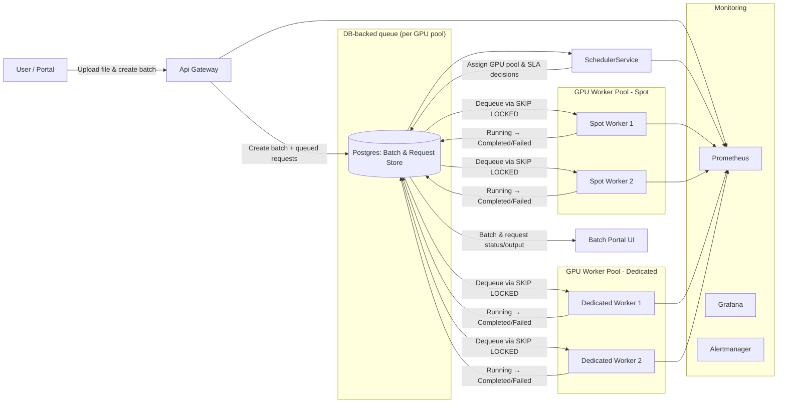

# Batch Processing POC

MVP for an OpenAI-style batch inference system: JSONL file upload, batch creation, SLA-aware scheduling across spot/dedicated GPU workers, automatic escalation/retry, a Batch Portal UI, and full Prometheus/Grafana/Alertmanager monitoring, all running on Kubernetes with PostgreSQL storage.

## Badges


## Table of Contents

- [Prerequisites](#prerequisites)
- [Local Setup](#local-setup)
- [Deployment](#deployment)
- [Running & Testing](#running--testing)
- [System Overview](#system-overview)
- [End-to-End Flow](#end-to-end-flow)
- [Request Lifecycle & Queue Semantics](#request-lifecycle--queue-semantics)
- [Architecture](#architecture)
- [Components](#components)
- [Development Guide](#development-guide)
- [Troubleshooting](#troubleshooting)
- [Missing Work](#missingfeatures)

<a name="prerequisites"></a>
## 🔧 Prerequisites

Before installing or deploying any part of this system, ensure the following dependencies are installed on your machine:

### 1. System Requirements
- macOS (Intel or Apple Silicon)  
- At least **16GB RAM** recommended (due to k8s + images + monitoring stack).

### 2. Core Tools

#### **Docker Desktop**
Required to run:
- Kubernetes cluster
- Container images
- Local volumes  

Install from: https://www.docker.com/products/docker-desktop/

Make sure Kubernetes is enabled in Docker Desktop:
Docker Desktop → Settings → Kubernetes → Enable Kubernetes

### 3. Kubernetes Tooling

#### **kubectl**
Command-line tool to interact with Kubernetes.
Install:
```bash
brew install kubectl
```

#### **Helm (Optional but recommended)**
Some users may want to install Grafana/Prometheus via Helm.
Install:
```bash
brew install helm
```

### 4. .NET SDK
The entire stack is written in **.NET 8**.
Install:
```bash
brew install --cask dotnet-sdk
dotnet --version
```

### 5. Postgres Client Tools
Used for debugging, schema inspection, manual database checks.

Install:
```bash
brew install libpq
brew link –force libpq
psql –version
```

### 6. Kubernetes Monitoring Stack Requirements

#### **Prometheus**
Runs inside Kubernetes as a Deployment.  
No host installation required, but you need:
- Correct YAML
- Persistent volumes
- RBAC permissions

#### **Grafana**
Runs inside Kubernetes.  
You need:
- Service type NodePort
- Prometheus datasource properly configured
- Dashboards ConfigMap loaded

#### **Alertmanager**
Runs inside Kubernetes.  
Requires:
- Proper alert rules mounted in `/etc/prometheus/rules`
- Correct Prometheus → Alertmanager config

### 7. Optional (but recommended)

#### **Lens / k9s**
GUI or terminal UI for Kubernetes cluster introspection.

Install Lens:
```bash
brew install –cask lens
```

Install k9s:
```bash
brew install k9s
```

### 8. Git + GitHub CLI
Recommended for cloning & maintaining the repo.

Install GitHub CLI:
```bash
brew install gh
```

### 9. Make (Optional)
If you want to convert shell scripts to a Makefile.
Already available on macOS.

### ✔️ Summary of Required Tools

| Component          | Required | Purpose |
|-------------------|----------|---------|
| Docker Desktop    | Yes      | K8s cluster + containers |
| Kubernetes (via Docker Desktop) | Yes | Local cluster |
| kubectl           | Yes      | Deploy YAML / debug pods |
| .NET 8 SDK        | Yes      | Build system services |
| libpq / psql      | Yes      | DB debugging |
| Grafana           | In cluster | Visual dashboards |
| Prometheus        | In cluster | Metrics scraping |
| Alertmanager      | In cluster | Alert routing |
| Helm              | Optional | Managing deployments |
| Lens / k9s        | Optional | GUI / TUI cluster tools |

---

## Local Setup

```bash
git clone <repo-url>
cd batch-processing-poc
dotnet restore
kubectl get nodes
```

---

## Deployment

All Kubernetes manifests live under `k8s/`. Use the helper script to deploy everything (Postgres, ApiGateway, SchedulerService, spot & dedicated GPU workers, Batch Portal, Prometheus, Grafana, Alertmanager). Or deploy all:

```bash
./scripts/redeploy-all.sh <optional version>
Example:
./scripts/redeploy-all.sh v1
```

---

## Running & Testing

### Automated tests

```bash
dotnet test
```

### Portal access

```bash
kubectl port-forward svc/batch-portal 5129:80 -n batch-inference
```

Visit [http://localhost:5129](http://localhost:5129).

### API access (NodePort 30080)

Upload JSONL file:

```bash
curl -X POST -F "file=@slow-test.jsonl" http://localhost:30080/v1/files
```

Create batch:

```bash
curl -X POST http://localhost:30080/v1/batches \
  -H "Content-Type: application/json" \
  -d '{"inputFileId":"<FILE_ID>","userId":"my-user"}'
```

Get batch status:

```bash
curl http://localhost:30080/v1/batches/<BATCH_ID>
```

---

## System Overview

Implements an OpenAI-like batch processing API with JSONL file upload, batch creation, SLA-aware scheduling, simulated spot/dedicated GPU workers, retries/escalations on interruptions, and monitoring. All metadata/results persist in PostgreSQL, and the Batch Portal provides a user-friendly front end over the same API.

---

## End-to-End Flow

1. User uploads a JSONL file.
2. ApiGateway stores the file and metadata in PostgreSQL.
3. User creates a batch referencing the uploaded file.
4. SchedulerService detects the queued batch.
5. Scheduler splits the file into per-line `RequestEntity` rows with `Status = Queued` and the selected GPU pool (spot/dedicated).
6. Requests stay persisted in Postgres until a worker dequeues them.
7. GPU workers repeatedly fetch queued requests for their pool, atomically marking them `Running` via `FOR UPDATE SKIP LOCKED`.
8. Successful requests transition to `Completed`; terminal failures move to `Failed`; spot interruptions are re-queued.
9. Batches finalize once every request is either `Completed` or `Failed`.
10. Portal/API expose batch and request details plus outputs.

---

### Request Lifecycle & Queue Semantics

- **Queued** – request has been persisted and is waiting in the Postgres-backed queue.
- **Running** – a worker has claimed the request inside a transaction and is processing it.
- **Completed** – processing finished successfully and output payload was recorded.
- **Failed** – a terminal error occurred; the request will not be retried.
- **DeadLettered** – reserved for future DLQ behaviour (not yet used in this POC).

Postgres doubles as the durable queue. Workers select the oldest `Queued` row (ordered by `CreatedAt`) for their GPU pool using `FOR UPDATE SKIP LOCKED`, immediately flip it to `Running`, and commit the transaction so no other worker can double-claim it. This pattern provides safe multi-worker dequeue semantics without a separate message broker.

---

## Architecture




## Components

### ApiGateway
- Minimal HTTP API for file upload, batch creation, status retrieval.
- Persists metadata/results to PostgreSQL.
- Exposes Prometheus metrics.

### SchedulerService
- Scans queued batches and splits files into per-request work items.
- Assigns spot/dedicated pools, applies SLA-aware escalation, retries interruptions.
- Updates database and emits metrics.

### GPU Workers (spot & dedicated)
- Simulated GPU compute.
- Spot workers may fail with “Simulated spot interruption”.
- Dedicated workers provide stable processing.

### PostgreSQL
- Persistent store for files, batches, requests, results, error messages.

### Batch Portal
- ASP.NET Razor Pages UI for submitting batches, tracking progress, and viewing results/escalation info.
- Links to Grafana dashboards for observability.

### Prometheus / Grafana / Alertmanager
- Prometheus scrapes metrics from all services.
- Grafana provides dashboards.
- Alertmanager handles alerting (config stubbed for easy extension).

---

## Development Guide

Run services locally without Kubernetes:

```bash
# ApiGateway
cd ApiGateway
dotnet run

# SchedulerService
cd SchedulerService
dotnet run

# GPU Worker (spot or dedicated)
cd GpuWorker
dotnet run
```

Use `dotnet watch run` for hot reload during development. Inspect logs in Kubernetes via:

```bash
kubectl logs -n batch-inference <pod-name>
```

---

## Troubleshooting

| Issue | Resolution |
|-------|------------|
| Portal errors when creating batches | Verify Postgres connection string and inspect Postgres pod logs. |
| API unreachable at `localhost:30080` | Ensure NodePort service exists: `kubectl get svc -n batch-inference`. |
| Prometheus missing rules | Confirm `/etc/prometheus/rules` volume is mounted and `k8s/monitoring/alert-rules.yaml` applied. |
| “Simulated spot interruption” floods logs | Expected behavior; confirm Scheduler requeues/escalates to dedicated workers. |
| Redeployed pods are not updated | Make sure to increase the version when running the redeployment scripts |

---

<a name="missingfeatures"></a>
## 🚧 Missing Features & Future Improvements

This Proof-of-Concept implements an end-to-end batch processing pipeline (API → DB → Scheduler → GPU workers → storage → monitoring), but several production-grade capabilities are intentionally incomplete or stubbed out.

Below is a consolidated list of what is currently missing and what would be implemented next in a real system.

### 1. Dynamic Worker Autoscaling (Backlog-Based)

**Missing:**

- Worker replica counts are static in Kubernetes `Deployment` manifests.
- The scheduler computes SLA risk and GPU pool selection but does **not** dynamically change the number of workers.

**Target behaviour:**

- Maintain a dynamic ratio of:
  - **Spot workers**: `ceil(pending_spot_requests / 5)`
  - **Dedicated workers**: `ceil(pending_dedicated_requests / 10)`
- Clamp replica counts using configurable min/max bounds per pool.

**Implementation sketch:**

- Add a `WorkerAutoscaler` hosted service in `SchedulerService` that:
  - Queries Postgres for `Queued` requests by `GpuPool`.
  - Computes desired replicas using the ratios above.
  - Exposes metrics such as:
    - `autoscaler_desired_spot_replicas`
    - `autoscaler_desired_dedicated_replicas`
  - (Optionally) uses the Kubernetes API (with RBAC) to patch:
    - `deployment/gpu-worker-spot`
    - `deployment/gpu-worker-dedicated`

### 2. Robust Error Handling, Retries & Dead-Letter Queue

**Missing:**

- Only basic retry handling for simulated spot interruptions.
- No global, configurable retry strategy.
- No dedicated Dead-Letter Queue (DLQ).
- No visibility in the portal into “permanently failed” work.

**Future work:**

- Add retry counters and max-attempts per request.
- Use exponential backoff and jitter for retries.
- Introduce a DLQ table and mark requests as `DeadLettered` after exhausting retries.
- Expose DLQ in the portal with an option to:
  - Requeue a subset of DLQ items.
  - Download inputs/outputs for debugging.

### 3. Authentication, Authorization & Multi-Tenancy

**Missing:**

- No real auth; “user” is a text field / header for demo purposes.
- No tenant isolation.
- No audit logging.

**Future work:**

- Integrate with an IdP (e.g. Auth0 / OAuth2 / OIDC).
- Use JWTs or similar to derive `UserId` and `TenantId`.
- Enforce row-level security per user/tenant on:
  - Files
  - Batches
  - Requests
- Add an audit log for key actions (create batch, cancel batch, download result).

### 4. Cloud Object Storage Integration

**Current state:**

- File content is stored on a local volume mounted inside Kubernetes (mocking object storage).

**Missing:**

- No real S3/GCS/Azure Blob integration.
- No retention or lifecycle policies.

**Future work:**

- Replace local storage with a pluggable abstraction, then implement:
  - AWS S3 (or equivalent) backend.
  - Pre-signed upload URLs for large input files.
  - Pre-signed download URLs for batch output files.
- Add lifecycle rules (e.g. delete files after N days or after batch expiry).

### 5. Real GPU Inference Engine

**Current state:**

- GPU workers simulate work (sleep / dummy processing) to model latency and spot interruptions.

**Missing:**

- Actual LLM / model runtime.
- GPU-aware batching, tokenization, and streaming.
- Model loading and refreshing.

**Future work:**

- Provide GPU-enabled worker images that:
  - Load one or more models on startup.
  - Perform tokenization and batching.
  - Report performance metrics (tokens/sec, latency, GPU utilization).
- Integrate with a inference engines, model runtimes and frameworkd (CUDA / PyTorch / Triton / TensorFlow / vLLM / etc).

### 6. SLA Enforcement & Observability

**Current state:**

- Scheduler considers `CompletionWindow` and performs SLA-aware pool selection and escalation (spot → dedicated when at risk).

**Missing:**

- End-to-end SLA tracking per request and per batch.
- Alerting on SLA violations and queue buildup.
- Historical SLA dashboards.

**Future work:**

- Track SLA status for each request and batch.
- Expose metrics like:
  - `requests_sla_met_total`
  - `requests_sla_violated_total`
  - `queue_wait_time_bucket`
- Add Prometheus alert rules and Grafana dashboards for:
  - High queue age.
  - Persistent SLA violations.
  - Abnormal spot interruption rates.

### 7. Queue Fairness, Rate Limiting & Isolation

**Missing:**

- No per-user rate limiting or fairness.
- Large batches for one user can starve others.

**Future work:**

- Introduce queue partitioning by user / tenant.
- Add fair scheduling (e.g. weighted round-robin or WFQ).
- Enforce per-user limits on:
  - Concurrent batches.
  - Total in-flight requests.

### 8. Portal UX & Developer Experience

**Current state:**

- Portal is intentionally minimal: upload file, submit batch, see status.

**Missing:**

- UX polish and responsive design.
- Search, sort, filtering and pagination for batches/requests.
- Real-time updates (SignalR / websockets / polling).
- Direct links to Grafana dashboards.

**Future work:**

- Add richer batch details:
  - Progress bars.
  - Per-request status breakdown.
  - Links to input/output files.
- Add developer tooling pages:
  - “System health” summary.
  - Links to alerting and dashboards.

### 9. End-to-End, Load & Chaos Testing

**Missing:**

- Only unit tests and basic functional tests.
- No full end-to-end pipeline tests under load.
- No chaos testing for:
  - Spot interruption storms.
  - DB failures.
  - Worker crashes.

**Future work:**

- Add integration tests that exercise:
  - API → DB → Scheduler → Workers → Storage → Metrics.
- Add load tests to validate:
  - Throughput.
  - Backlog behaviour.
  - SLA under high concurrency.
- Add chaos experiments for:
  - Random pod deletions.
  - Simulated network partitions.

### 10. Security & Hardening

**Missing:**

- No TLS termination in front of the API / portal.
- Secrets are Kubernetes secrets only (no external secret store).
- Containers are not hardening-focused.

**Future work:**

- Add ingress with HTTPS termination.
- Integrate with a secret manager (Vault / SOPS / cloud-native).
- Run containers as non-root with minimal permissions.
- Add NetworkPolicies to restrict pod-to-pod communication.

### 11. CI/CD & Environment Promotion

**Missing:**

- No automated pipelines.
- No environment promotion strategy.

**Future work:**

- GitHub Actions (or similar) for:
  - Build → test → containerize → push.
  - Apply manifests via ArgoCD / Flux in dev/stage/prod.
- Versioned rollouts and canaries for:
  - API gateway.
  - Scheduler.
  - Workers.
  - Portal.
