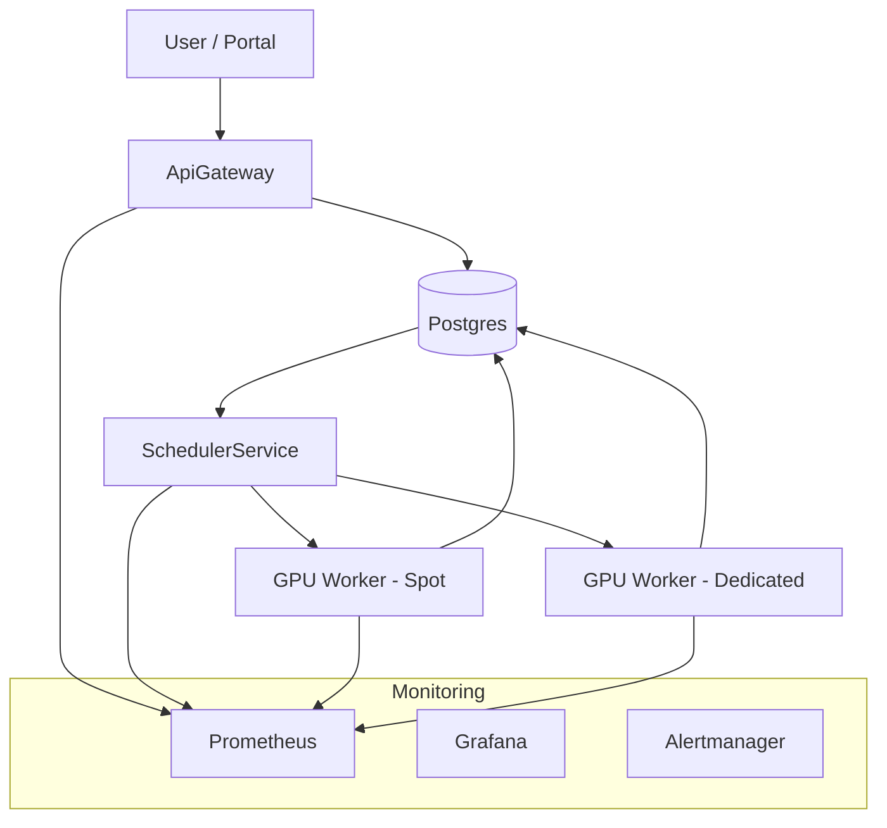

# Batch Processing POC

MVP for an OpenAI-style batch inference system: JSONL file upload, batch creation, SLA-aware scheduling across spot/dedicated GPU workers, automatic escalation/retry, a Batch Portal UI, and full Prometheus/Grafana/Alertmanager monitoring, all running on Kubernetes with PostgreSQL storage.

## Badges


## Table of Contents

- [Prerequisites](#prerequisites)
- [Local Setup](#local-setup)
- [Deployment](#deployment)
- [Running & Testing](#running--testing)
- [System Overview](#system-overview)
- [End-to-End Flow](#end-to-end-flow)
- [Architecture](#architecture)
- [Components](#components)
- [Development Guide](#development-guide)
- [Troubleshooting](#troubleshooting)

🔧## Prerequisites

Before installing or deploying any part of this system, ensure the following dependencies are installed on your machine:

### 1. System Requirements
- macOS (Intel or Apple Silicon)  
- At least **16GB RAM** recommended (due to k8s + images + monitoring stack).

---

### 2. Core Tools

#### **Docker Desktop**
Required to run:
- Kubernetes cluster
- Container images
- Local volumes  
Install from: https://www.docker.com/products/docker-desktop/

Make sure Kubernetes is enabled in Docker Desktop:
Docker Desktop → Settings → Kubernetes → Enable Kubernetes
---

### 3. Kubernetes Tooling

#### **kubectl**
Command-line tool to interact with Kubernetes.
Install:
brew install kubectl

#### **Helm (Optional but recommended)**
Some users may want to install Grafana/Prometheus via Helm.
Install:
brew install helm

---

### 4. .NET SDK
The entire stack is written in **.NET 8**.
Install:
brew install –cask dotnet-sdk

Verify:
dotnet –version

---

### 5. Postgres Client Tools
Used for debugging, schema inspection, manual database checks.

Install:
brew install libpq
brew link –force libpq

Verify:
psql –version

---

### 6. Kubernetes Monitoring Stack Requirements

#### **Prometheus**
Runs inside Kubernetes as a Deployment.  
No host installation required, but you need:
- Correct YAML
- Persistent volumes
- RBAC permissions

#### **Grafana**
Runs inside Kubernetes.  
You need:
- Service type NodePort
- Prometheus datasource properly configured
- Dashboards ConfigMap loaded

#### **Alertmanager**
Runs inside Kubernetes.  
Requires:
- Proper alert rules mounted in `/etc/prometheus/rules`
- Correct Prometheus → Alertmanager config

---

### 7. Optional (but recommended)

#### **Lens / k9s**
GUI or terminal UI for Kubernetes cluster introspection.

Install Lens:
brew install –cask lens

Install k9s:
brew install k9s

---

### 8. Git + GitHub CLI
Recommended for cloning & maintaining the repo.

Install GitHub CLI:
brew install gh

---

### 9. Make (Optional)
If you want to convert shell scripts to a Makefile.
Already available on macOS.

---

### ✔️ Summary of Required Tools

| Component          | Required | Purpose |
|-------------------|----------|---------|
| Docker Desktop    | Yes      | K8s cluster + containers |
| Kubernetes (via Docker Desktop) | Yes | Local cluster |
| kubectl           | Yes      | Deploy YAML / debug pods |
| .NET 8 SDK        | Yes      | Build system services |
| libpq / psql      | Yes      | DB debugging |
| Grafana           | In cluster | Visual dashboards |
| Prometheus        | In cluster | Metrics scraping |
| Alertmanager      | In cluster | Alert routing |
| Helm              | Optional | Managing deployments |
| Lens / k9s        | Optional | GUI / TUI cluster tools |

---

## Local Setup

```bash
git clone <repo-url>
cd batch-processing-poc
dotnet restore
kubectl get nodes
```

## Deployment

All Kubernetes manifests live under `k8s/`. Use the helper script to deploy everything (Postgres, ApiGateway, SchedulerService, spot & dedicated GPU workers, Batch Portal, Prometheus, Grafana, Alertmanager):

```bash
./scripts/deploy-all.sh
```

## Running & Testing

### Automated tests

```bash
dotnet test
```

### Portal access

```bash
kubectl port-forward svc/batch-portal 5129:80 -n batch-inference
```

Visit [http://localhost:5129](http://localhost:5129).

### API access (NodePort 30080)

Upload JSONL file:

```bash
curl -X POST -F "file=@slow-test.jsonl" http://localhost:30080/v1/files
```

Create batch:

```bash
curl -X POST http://localhost:30080/v1/batches \
  -H "Content-Type: application/json" \
  -d '{"inputFileId":"<FILE_ID>","userId":"my-user"}'
```

Get batch status:

```bash
curl http://localhost:30080/v1/batches/<BATCH_ID>
```

## System Overview

Implements an OpenAI-like batch processing API with JSONL file upload, batch creation, SLA-aware scheduling, simulated spot/dedicated GPU workers, retries/escalations on interruptions, and monitoring. All metadata/results persist in PostgreSQL, and the Batch Portal provides a user-friendly front end over the same API.

## End-to-End Flow

1. User uploads a JSONL file.
2. ApiGateway stores the file and metadata in PostgreSQL.
3. User creates a batch referencing the uploaded file.
4. SchedulerService detects the queued batch.
5. Scheduler splits the file into per-line requests.
6. Requests are dispatched to spot GPU workers first.
7. Spot workers process requests; some fail with simulated spot interruptions.
8. Scheduler retries failed requests and escalates to dedicated workers when SLA risk is detected.
9. Batch is marked completed once all requests finish (success or failure).
10. Portal/API expose batch and request details plus outputs.

## Architecture




## Components

### ApiGateway
- Minimal HTTP API for file upload, batch creation, status retrieval.
- Persists metadata/results to PostgreSQL.
- Exposes Prometheus metrics.

### SchedulerService
- Scans queued batches and splits files into per-request work items.
- Assigns spot/dedicated pools, applies SLA-aware escalation, retries interruptions.
- Updates database and emits metrics.

### GPU Workers (spot & dedicated)
- Simulated GPU compute.
- Spot workers may fail with “Simulated spot interruption”.
- Dedicated workers provide stable processing.

### PostgreSQL
- Persistent store for files, batches, requests, results, error messages.

### Batch Portal
- ASP.NET Razor Pages UI for submitting batches, tracking progress, and viewing results/escalation info.
- Links to Grafana dashboards for observability.

### Prometheus / Grafana / Alertmanager
- Prometheus scrapes metrics from all services.
- Grafana provides dashboards.
- Alertmanager handles alerting (config stubbed for easy extension).

## Development Guide

Run services locally without Kubernetes:

```bash
# ApiGateway
cd ApiGateway
dotnet run

# SchedulerService
cd SchedulerService
dotnet run

# GPU Worker (spot or dedicated)
cd GpuWorker
dotnet run
```

Use `dotnet watch run` for hot reload during development. Inspect logs in Kubernetes via:

```bash
kubectl logs -n batch-inference <pod-name>
```

## Troubleshooting

| Issue | Resolution |
|-------|------------|
| Portal errors when creating batches | Verify Postgres connection string and inspect Postgres pod logs. |
| API unreachable at `localhost:30080` | Ensure NodePort service exists: `kubectl get svc -n batch-inference`. |
| Prometheus missing rules | Confirm `/etc/prometheus/rules` volume is mounted and `k8s/monitoring/alert-rules.yaml` applied. |
| “Simulated spot interruption” floods logs | Expected behavior; confirm Scheduler requeues/escalates to dedicated workers. |

